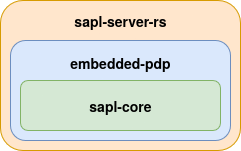

# SAPL meets Rust

## Voraussetzungen

Eine Rust Installation wird benötigt. Am einfachsten ist die Installation via [rustup](https://rustup.rs/). Nach der Installation kann der ganze workspace mit cargo mit dem folgenden Befehl übersetzt werden.

```
cargo build
```

Alle Tests im workspace können mit dem folgenden Befehl übersetzt werden.

```
cargo test
```

## Übersicht



### sapl-core
Diese Bibliothek enthält eine [pest](https://pest.rs)))) Grammatik für das parsen von Sapl Policies. Auch die Logik für die Auswertung einer Subscription ist hier realisiert.

### embedded-pdp
Diese Bibliothek realisiert mit der Hilfe von sapl-core einen [PDP](https://sapl.io/docs/3.0.0-SNAPSHOT/2_3_PolicyDecisionPoint/). Die Implementierung der verschiedenen Policiy Decision Kombinationsalgorithmen.
- [ ] DENY_UNLESS_PERMIT
- [ ] PERMIT_UNLESS_DENY
- [ ] ONLY_ONE_APPLICABLE
- [ ] DENY_OVERRIDES
- [ ] PERMIT_OVERRIDES

### remote-pdp
Ein mit dem Web Framework [Rocket](https://rocket.rs/) realisierter Server. Es sind die beiden folgenden RESTful Api Endpunkten realisiert
* /api/pdp/decide => liefert einen Sapl Decision Stream im json Format
* /api/pdp/decide_once => liefert eine Sapl Decision im json Format

### research
Hier sind Demos und Test Projekte enthalten.
* antlr-parser => Test Projekt eines antlr parser für rust
* file-reader => Demo Projekt zum Überwachen eines Verzeichnisses und lesen von Dateien
* tokio-stream-demo => Demo Projekt zum streams
