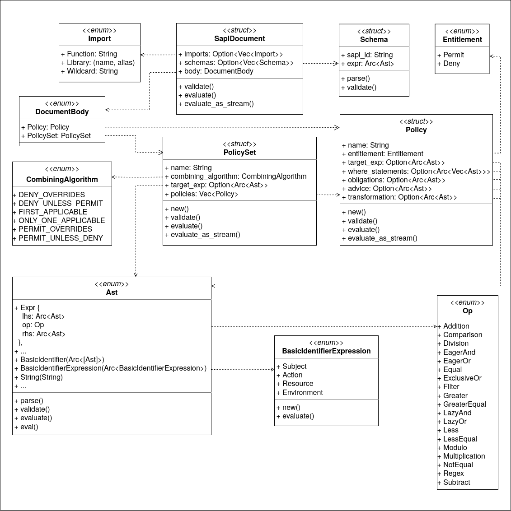

# SAPL-CORE 

This module contains the grammar definition and all core components of the policy engine. This library can be used in other applications where SAPL functionality is required. An attempt was made to use names that are as close as possible to those commonly used in SAPL.

> [!NOTE]
> This SAPL implementation is still in the alpha stage and does not have all features implemented. For productive use, please refer to the implementation [https://github.com/heutelbeck/sapl-policy-engine](https://github.com/heutelbeck/sapl-policy-engine).

> [!NOTE]
> The crate is not published on [crates.io](https://crates.io/) and therefore cannot be imported from there via `cargo`.

## Prerequisites

A Rust installation is required. The easiest way to install is via [rustup](https://rustup.rs/). Use at minimum rust version 1.88.0. After installation, the application can be compiled with cargo using the following command.

```
cargo build
```

## Run Tests

The project contains unit tests, policy parsing tests and some integration tests as well. To run these tests, please use the following command.

```
cargo test
```

## Policy parsing with pest
[pest](https://pest.rs/) is a general purpose parser written in Rust. It uses [parsing expression grammars (or PEG)](https://en.wikipedia.org/wiki/Parsing_expression_grammar) as input, which are similar in spirit to regular expressions, but which offer the enhanced expressivity needed to parse complex languages.

### How it works
The sapl grammar definition is located in `grammar/sapl.pest`.
The derive marco `#[derive(Parser)]` in `src/lib.rs` generates the parser at compile time direct into the binary file.
Next, in the function `parse_sapl_file()` also located in `src/lib.rs`, the pest parser output is parsed into the struct SaplDocument.

## Core Components
The following section provides an overview and brief description of the most important parts of the library.

### Struct SaplDocument
Each successfully parsed policy is represented as a SaplDocument. The following image provides a quick overview of the structure and possible components of a SaplDocument.



### Struct Policy
The Struct Policy represents an SAPL policy with all its possible contents. The name and entitlement are mandatory. All other fields are optional. This is expressed using the `Option< >`.

### Struct PolicySet
The Struct PolicySet represents an SAPL policy set with all its possible contents. The name and combination algorithm are mandatory, and all other fields are optional.

### Enum Ast.rs
In this enum, the main part of the SAPL grammar is parsed into an abstract syntax tree (AST). For example, the struct Policy in the target_exp field contains an AST.
For AST, there are two functions, `evaluate()` and the implementation of the trait `Eval` used for stream based evaluation.

### Enum Val.rs
The Enum Val is important for evaluation and located under `src/val.rs`. All results and intermediate results of the evaluation process are represented in this Enum.
If you have a expression like `5 > 2` the result would be `Val::Boolean(true)`.

### Evaluation
All evaluation functions are located under `src/evaluate/*`. These functions usually have the same signature.

```
function_name(lhs: &Result<Val, String>, rhs: &Result<Val, String>) -> Result<Val, String> {
```
In all comparison operations or mathematical operations, lhs and rhs always attempt to generate a result. If this is not successful, an error is returned.

### Streams
The components for the stream handling are located under `src/stream_sapl` and in `src/stream_sapl.rs`. For example the struct EvalOp implements a stream that combine two streams with a given operation function into one new stream. This operation function is one of the functions located under `src/evaluate/*`. The function `eq` as example check if both stream results are equal.

### Combining Algorithm
The combining algorithm implementation is under `src/sapl_document/combining_algorithm.rs`. On the one hand, there is the enum with the possible algorithms and also the implementation as individual functions.

A detailed description of the algorithms can be found at [https://sapl.io/docs/3.0.0-SNAPSHOT/6_5_CombiningAlgorithm/](https://sapl.io/docs/3.0.0-SNAPSHOT/6_5_CombiningAlgorithm/).
